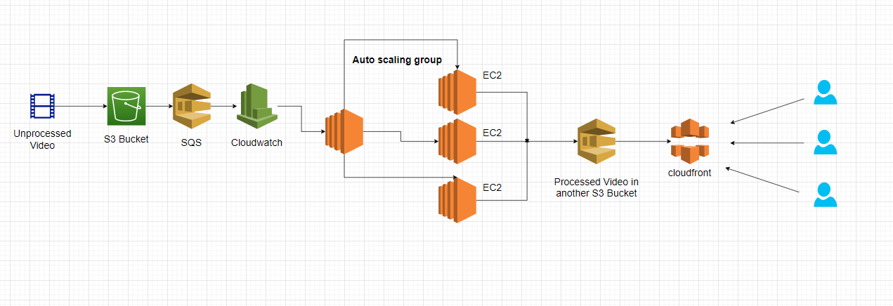

# Media Processor with AutoScale Ability 
 s3 -> sqs -> CloudwatchAlarm -> AutoScaleGroup -> Ec2 Template

To do List -

- [x] s3 bucket (source, destinition)
- [x] bucket cors, policy
- [x] cloudfront, bucket policy
- [x] sqs queue
- [x] s3 notification to sqs
- [x] ec2 launch template
- [x] autoscaling group
- [x] sqs cloudwatch alarm
- [x] autoscale based on cloudwatch alarm
<!-- - [ ] download and run code from github -->
- [ ] process
- [x] upload to destination
- [x] log (system, processing log)
- [ ] dead letter queue
<!-- - [ ]  -->

#### Inspiration

Architecture Inspiration taken from [Darshil Rathod](https://towardsaws.com/implementing-a-scalable-video-streaming-system-on-aws-4249ce5e8693)

Now implementing it in terraform.

get availability zones - `aws ec2 describe-availability-zones --region region-name`

Oh, this [reddit post](https://www.reddit.com/r/aws/comments/aclw37/please_help_with_terraform_script_with/) helped a lot.

(c) Ashraf Minhaj